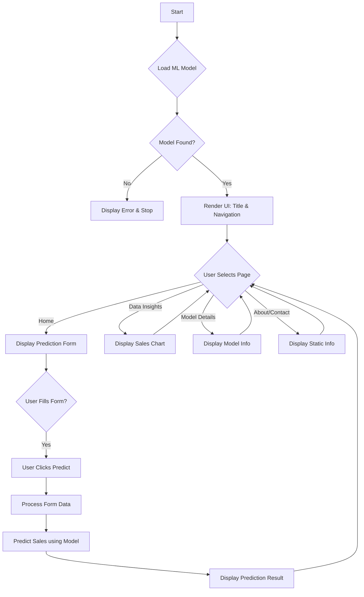

# 🛒 BigMart Sales Forecasting Pipeline

This project showcases a complete **Data Engineering + Machine Learning pipeline** using BigMart retail sales data. It includes automated data ingestion, MySQL database setup, model training, and deployment via a Streamlit app.

👉 **Live Demo:**[(https://bigmartsaleprediction.streamlit.app/)](https://bigmart-sales-prediction-app.streamlit.app/)

---

## 🧱 Architecture Overview

